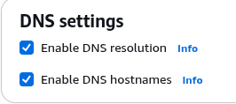

# README

## Table of Contents

1. EKS Setup Module
2. EKS Workflow Module
3. DB Setup Module
4. How to Run

---

>This overview outlines the essential components for setting up and managing an EKS cluster with a database and Helm charts.

>The version of Kubernetes is 1.34
---

### EKS Setup Module

The EKS module sets up the configuration for networking and defines how the EKS cluster will operate.

In the `cluster_subnets.tf` file, we create four subnets—two private and two public—across two different availability zones. This setup ensures that if one availability zone becomes unavailable, EKS can deploy resources in the other zone. The private subnets are designated for the node group, allowing us to keep our cluster private, while the public subnets are used for the NAT gateway and Elastic Load Balancers (ELBs). These public subnets must have additional tags to enable the cluster to provision ELBs.

In the `cluster_nat.tf` file, we create a NAT gateway to ensure that the nodes have access to the internet.

The `cluster_addons.tf` file includes all necessary addons that will be useful for managing our cluster, like the **metric server** or **pod identity**.

In the `cluster_setup.tf`, we configure the policy and role. To enable the attaching of IAM roles to the Kubernetes role, we set the authentication mode to "API". Additionally, the user who creates the cluster automatically gains an admin role in the cluster.

In the `node_setup` file, we configure the role for the node group and establish the rules for the autoscaling group.

---

### EKS Workflow Setup

In the EKS workflow setup, we configure the **Cluster Autoscaler** and the **AWS Load Balancer Controller** by creating a role for them and mapping this role to the service account using pod identity.

To run the Helm charts locally for your cluster management services, you need to change:

```
repository = ""
```

to:

```
repository = "./helm"
```

If you are running it from Jenkins, create an external repository (for example, in Amazon ECR), push your Helm chart there, and link it using:

```
repository = "your-external-repo-link"
```

#### Custom values for helm chart

Typically, Helm charts can operate with default values specified in the `values.yaml` file located in the root of the chart folder. However, if there are no values provided in this file, you can use a custom values file or pass values using the `set` block in Terraform.

The `set` block allows you to configure variables for a Helm chart. You can still utilize the default values if needed, but the `set` block takes precedence.

---

### DB Setup

The database name is `illuminates`, which is a result of a typographical error in the Liquibase migrations, even though the project is named "illuminati." This name should be corrected in the future, but for now, we will continue with the current state of the project.

We are using MariaDB as the database engine (version 10.11). Although the DB instance is currently located in a public route table, its security rules restrict inbound connections to accept only from the node group. This may change in the future.

If you need to connect to the database from a management tool, you must add your IP to the rules and enable DNS resolution and hostnames in the VPC settings.



To populate the database with data, we run a Helm chart containing the Liquibase migration job. Here’s an overview of what the Liquibase jobs do:

1. An init container with a Git image is used to clone the repository with the required migrations to an ephemeral volume.
2. Then, the Liquibase container runs migrations on our database, creating a new table and adding primary data, such as the entry password or the first user.
3. Additionally, it creates a Secret resource that will later be used by the backend deployment to retrieve database secrets.

To make it possible to run migration, we configured the main EKS workflow file by passing the output from the previous module, including the cluster name and credentials for the cluster, and established the kube config inside the Helm provider.

The Liquibase job runs automatically after the database has been created.

---

### How to run

To run it locally, you should clone the repository and add a custom `.tfvars` file.

Here is a template you can use for the `.tfvars` file:

```hcl
#--------------------------------------------------------- Availability Zones

cluster_availability_zone_1 = "" # Like eu-central-1a 
cluster_availability_zone_2 = ""
private_subnet_cidr_block_1 = "" # Like 10.0.2.0/24
private_subnet_cidr_block_2 = ""
public_subnet_cidr_block_1  = ""
public_subnet_cidr_block_2  = ""

#--------------------------------------------------------- Node Group Autoscaling Config

min_size     = 1
max_size     = 5
desired_size = 1

#--------------------------------------------------------- Cluster Configuration Variables

eks_cluster_name        = "" # Like illuminati_app_cluster
environment_name        = "" # Like dev, stage or prod
eks_cluster_k8s_version = "1.34"

#--------------------------------------------------------- Nodes Configuration Variables

node_instance_types = ["t3.small"]

#--------------------------------------------------------- Workflow Setup

region                = "" # Like eu-central-1
vpc_id                = "" # Like vpc-xxxxxxxxxxxxxxxxx 
public_route_table_id = "" # Like rtb-xxxxxxxxxxxxxxxxx 

#--------------------------------------------------------- Database Setup

db_username         = "" 
db_password         = "" # The password should consist of at least 8 characters.
db_private_subnet_1 = "" # Like 10.0.2.0/24
db_private_subnet_2 = ""
```

Additionally, add the `--var-file={file-name}.tfvars` flag to the commands in the Makefile for the following blocks:

1. plan
2. apply
3. init
